# Technical Implementation Details

This document provides an in-depth explanation of how LocalSend Rust works internally, covering the core technologies, protocols, and design decisions.

## Table of Contents

1. [Architecture Overview](#architecture-overview)
2. [Device Discovery](#device-discovery)
3. [Protocol Communication](#protocol-communication)
4. [Server Implementation](#server-implementation)
5. [Client Implementation](#client-implementation)
6. [File Transfer Mechanics](#file-transfer-mechanics)
7. [Security Model](#security-model)
8. [State Machine](#state-machine)
9. [Type Safety](#type-safety)

---

## Architecture Overview

### System Architecture Diagram

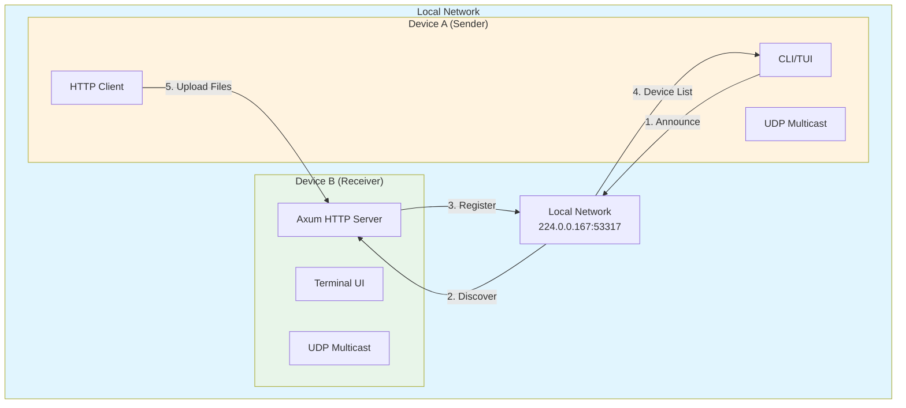

### Module Structure

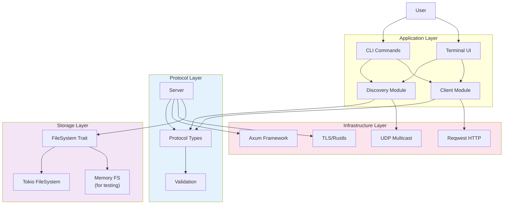

---

## Device Discovery

### Multicast UDP Discovery

LocalSend uses **UDP multicast** to discover devices on the local network. This allows multiple devices to find each other without a central server.

#### Multicast Configuration

| Parameter | Value | Description |
|-----------|-------|-------------|
| **Multicast IP** | `224.0.0.167` | IPv4 multicast address (organization-local) |
| **Port** | `53317` | Default LocalSend port |
| **Broadcast Interval** | 1 second | How often devices announce themselves |
| **Discovery Timeout** | 10 seconds | How long to wait for responses |

#### Discovery Protocol

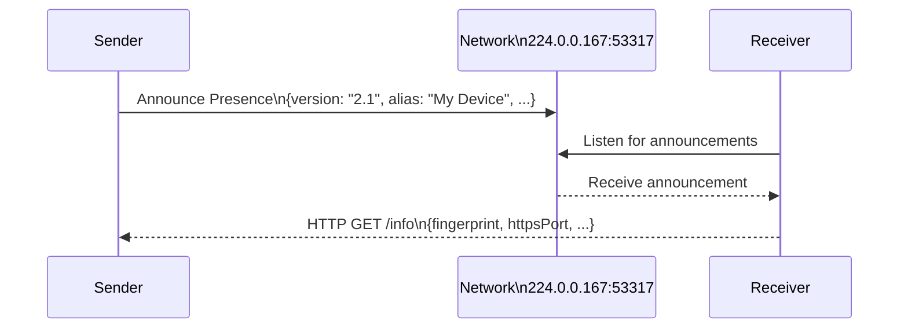

#### Implementation Details

**Announcement Message (UDP):**
```rust
// Sent via UDP to 224.0.0.167:53317
#[derive(Serialize)]
struct Announcement {
    version: String,           // "2.1"
    alias: String,            // Device name
    device_type: DeviceType,  // Mobile/Desktop
    device_model: String,     // "iPhone 15", "MacBook Pro", etc.
    fingerprint: String,      // SHA-256 hash for TLS
    port: u16,                // HTTPS port (usually 53317)
    protocol: Protocol,       // HTTPS/HTTP
    download: bool,           // Supports download API
}
```

**Discovery Process:**
```rust
impl MulticastDiscovery {
    pub async fn announce_presence(&self) {
        let socket = UdpSocket::bind("0.0.0.0:0").await?;
        let addr = "224.0.0.167:53317".parse().unwrap();
        
        // Enable multicast
        socket.set_multicast_loop_v4(true)?;
        socket.set_multicast_ttl(4)?;
        
        let message = Announcement { /* ... */ };
        let data = serde_json::to_vec(&message)?;
        
        // Broadcast to network
        socket.send_to(&data, addr).await?;
    }
    
    pub async fn discover(&self, timeout: Duration) -> Vec<DeviceInfo> {
        let socket = UdpSocket::bind("0.0.0.0:53317").await?;
        
        let mut devices = Vec::new();
        let start = Instant::now();
        
        while start.elapsed() < timeout {
            // Try to receive announcements
            if let Ok((data, _)) = socket.recv_from(&mut buffer).await {
                let announcement: Announcement = serde_json::from_slice(&data)?;
                
                // Fetch device info via HTTP
                let device_info = self.fetch_device_info(&announcement).await?;
                devices.push(device_info);
            }
        }
        
        devices
    }
}
```

### HTTP Fallback Discovery

If UDP multicast is blocked (e.g., corporate networks), LocalSend falls back to HTTP-based discovery:

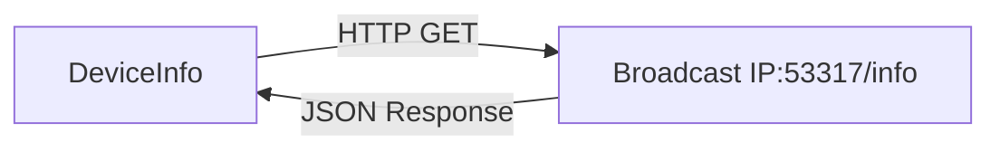

---

## Protocol Communication

### API Endpoints

LocalSend v2 uses a REST API over HTTP/HTTPS:

| Endpoint | Method | Description |
|----------|--------|-------------|
| `/api/localsend/v2/info` | GET | Get device information |
| `/api/localsend/v2/register` | POST | Register for session |
| `/api/localsend/v2/prepare-upload` | POST | Prepare file upload |
| `/api/localsend/v2/upload` | POST | Upload file content |
| `/api/localsend/v2/cancel` | POST | Cancel transfer |

### Protocol Flow

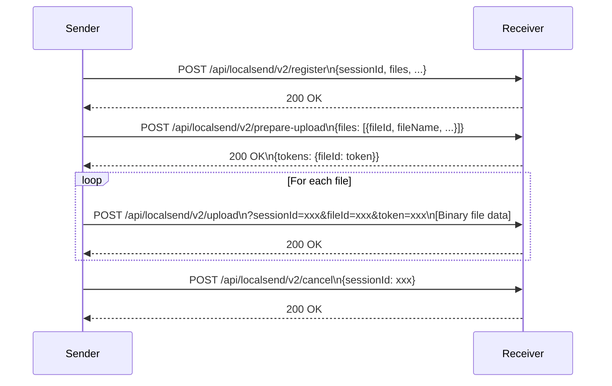

### Type-Safe Identifiers

To prevent errors, LocalSend Rust uses newtype pattern for protocol identifiers:

```rust
// Strong types prevent mixing up IDs at compile time
pub struct SessionId(String);      // Unique per transfer session
pub struct FileId(String);         // Unique per file in session
pub struct Token(String);          // Per-file authorization
pub struct Port(u16);              // Valid port numbers
pub enum Protocol { Http, Https }  // Protocol selection

// Usage prevents mistakes:
fn upload_file(
    session_id: &SessionId,      // Can't accidentally pass FileId here!
    file_id: &FileId,
    token: &Token,
    port: Port,
    protocol: Protocol,
) -> Result<()> { /* ... */ }
```

---

## Server Implementation

### Axum Framework

The server uses [Axum](https://github.com/tokio-rs/axum), a type-safe web framework for Rust:

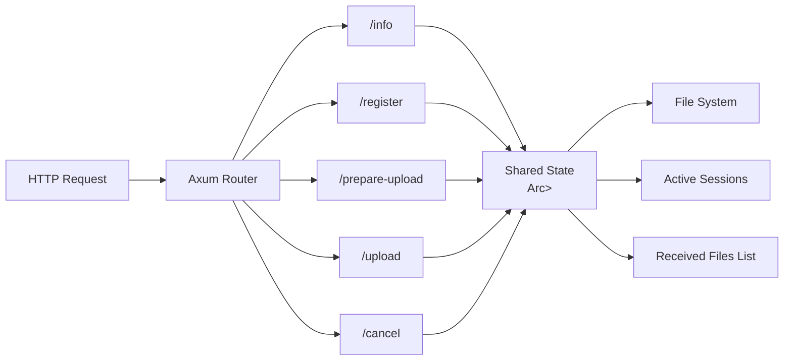

### Server State Management

```rust
#[derive(Clone)]
struct ServerState {
    device_info: DeviceInfo,
    save_dir: PathBuf,
    current_session: Option<ActiveSession>,
    pending_transfer: Arc<RwLock<Option<PendingTransfer>>>,
    received_files: Arc<RwLock<Vec<ReceivedFile>>>,
}

struct ActiveSession {
    session_id: SessionId,
    sender_alias: String,
    files: HashMap<FileId, FileMetadata>,
    tokens: HashMap<FileId, Token>,
    created_at: Instant,
    last_activity: Instant,
}
```

### Handler Example

```rust
#[axum::debug_handler]
async fn handle_register(
    State(state_ref): State<Arc<RwLock<ServerState>>>,
    Json(body): Json<RegisterRequest>,
) -> impl IntoResponse {
    let state = state_ref.write().await;
    
    // Create session
    let session = ActiveSession {
        session_id: body.session_id,
        sender_alias: body.alias,
        files: body.files.into_iter()
            .map(|f| (f.id.clone(), f))
            .collect(),
        tokens: HashMap::new(),
        created_at: Instant::now(),
        last_activity: Instant::now(),
    };
    
    state.current_session = Some(session);
    StatusCode::OK
}
```

### Async I/O for File Operations

File operations use `tokio::fs` to avoid blocking the async runtime:

```rust
async fn save_file(save_path: &Path, data: Bytes) -> Result<()> {
    // Async file write - doesn't block other tasks
    tokio::fs::write(save_path, data).await?;
    Ok(())
}

async fn create_directories(path: &Path) -> Result<()> {
    // Async directory creation
    if let Some(parent) = path.parent() {
        tokio::fs::create_dir_all(parent).await?;
    }
    Ok(())
}
```

---

## Client Implementation

### HTTP Client with Streaming

The client uses [Reqwest](https://docs.rs/reqwest/) for HTTP operations:

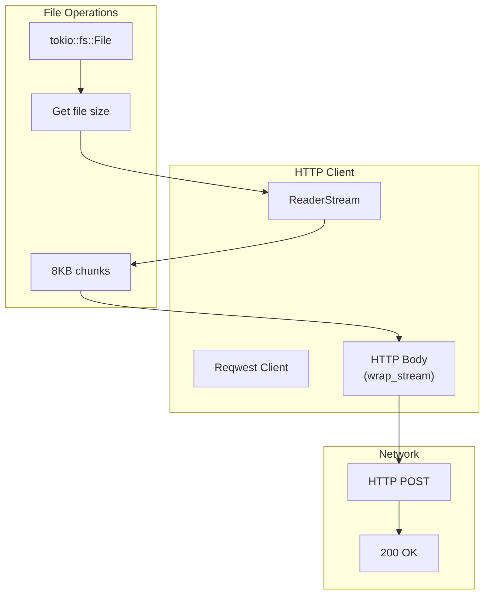

### Streaming File Upload

For memory efficiency, large files are streamed instead of loaded entirely:

```rust
pub async fn upload_file(
    &self,
    target: &DeviceInfo,
    session_id: &SessionId,
    file_id: &FileId,
    token: &Token,
    file_path: &Path,
    progress: Option<ProgressCallback>,
) -> Result<()> {
    let url = format!(
        "{}://{}:{}/api/localsend/v2/upload?sessionId={}&fileId={}&token={}",
        target.protocol, target.ip, target.port,
        session_id, file_id, token
    );
    
    // Open file asynchronously
    let file = File::open(file_path).await?;
    let total_bytes = file.metadata().await?.len();
    
    // Create streaming body
    let stream = ReaderStream::new(file);
    let body = Body::wrap_stream(stream);
    
    // Send with streaming (not entire file in memory!)
    let response = self.client.post(&url).body(body).send().await?;
    
    match response.status() {
        StatusCode::OK | StatusCode::NO_CONTENT => Ok(()),
        _ => Err(LocalSendError::http_failed(response.status().as_u16(), "Upload failed"))
    }
}
```

**Memory Comparison:**

| Approach | Memory Usage | Large File Support |
|----------|-------------|-------------------|
| Load entire file | O(file_size) | Limited by RAM |
| Streaming | O(buffer_size) | Unlimited |

---

## File Transfer Mechanics

### Transfer States

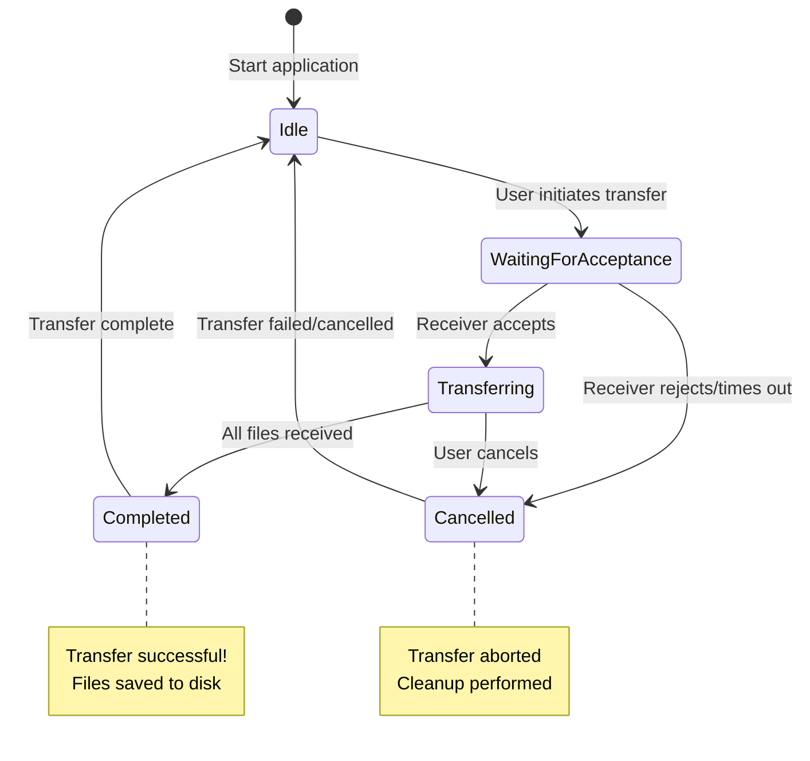

### Transfer State Machine Implementation

```rust
pub enum TransferState {
    Idle,
    WaitingForAcceptance {
        sender: DeviceInfo,
        files: Vec<FileMetadata>,
        timeout: Duration,
    },
    Transferring {
        session_id: SessionId,
        sender: DeviceInfo,
        files: Vec<FileMetadata>,
        completed: usize,  // Number of completed files
    },
    Completed {
        session_id: SessionId,
        total_files: usize,
    },
    Cancelled {
        reason: String,
    },
}

impl TransferState {
    /// Type-safe state transitions
    pub fn accept(self, session_id: SessionId) -> Result<TransferState, TransferError> {
        match self {
            TransferState::WaitingForAcceptance { sender, files, .. } => {
                Ok(TransferState::Transferring {
                    session_id,
                    sender,
                    files,
                    completed: 0,
                })
            }
            _ => Err(TransferError::InvalidStateTransition),
        }
    }
}
```

### Session Management

```rust
pub struct Session {
    id: SessionId,
    files: HashMap<FileId, FileMetadata>,
    tokens: HashMap<FileId, Token>,
    created_at: Instant,
    last_activity: Instant,
}

impl Session {
    /// Generate token for file
    pub fn generate_token(&mut self, file_id: &FileId) -> Token {
        let token = Token::new(&self.id, file_id);
        self.tokens.insert(file_id.clone(), token.clone());
        token
    }
    
    /// Check if session is expired (5 minute timeout)
    pub fn is_expired(&self) -> bool {
        self.last_activity.elapsed() > Duration::from_secs(5 * 60)
    }
}
```

---

## Security Model

### TLS/HTTPS Security

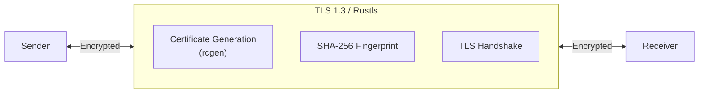

### Certificate Generation

```rust
// Self-signed certificate with rcgen
pub fn generate_certificate() -> (Vec<u8>, Vec<u8>, String) {
    let mut cert_gen = CertificateGenerator::new();
    
    cert_gen
        .subject_name("LocalSend Device")
        .validity_period_days(365)
        .signing_key_gen(SigningKeyGen::Rsa { key_size: 2048 });
    
    let (cert_pem, key_pem) = cert_gen.generate_pem();
    let fingerprint = sha256_from_pem(&cert_pem);
    
    (cert_pem, key_pem, fingerprint)
}
```

### Device Fingerprint

```rust
// SHA-256 fingerprint of certificate
pub fn generate_fingerprint() -> String {
    let cert_pem = get_certificate_pem();
    let cert_der = pem::parse(cert_pem)
        .and_then(|p| X509::from_der(&p.contents).ok())
        .expect("Valid certificate");
    
    let public_key = cert_der.public_key().unwrap();
    let public_key_bytes = public_key.to_der().unwrap();
    
    sha256_from_bytes(&public_key_bytes)
}
```

### Security Features

| Feature | Implementation | Purpose |
|---------|---------------|---------|
| **TLS Encryption** | Rustls, TLS 1.3 | Data in transit encryption |
| **Certificate Fingerprint** | SHA-256 of public key | Device authentication |
| **Token Authorization** | Per-file tokens | Prevent unauthorized uploads |
| **Session Timeout** | 5-minute inactivity | Auto-cleanup stale sessions |

---

## Type Safety

### Newtype Pattern

LocalSend Rust uses newtype wrappers for compile-time safety:

```rust
// Newtypes prevent mixing up identifiers
#[derive(Clone, Debug, Hash, PartialEq, Eq)]
pub struct SessionId(String);

#[derive(Clone, Debug, Hash, PartialEq, Eq)]
pub struct FileId(String);

#[derive(Clone, Debug, Hash, PartialEq, Eq)]
pub struct Token(String);

#[derive(Clone, Debug)]
pub struct Port(u16);

// Validation in constructor
impl SessionId {
    pub fn new(id: impl Into<String>) -> Self {
        let id = id.into();
        assert!(!id.is_empty(), "SessionId cannot be empty");
        assert!(id.len() <= 64, "SessionId too long");
        Self(id)
    }
}
```

### Structured Error Handling

```rust
#[non_exhaustive]
pub enum LocalSendError {
    Network {
        message: String,
    },
    SessionNotFound {
        session_id: SessionId,
    },
    FileNotFound {
        file_id: FileId,
        session_id: SessionId,
    },
    VersionMismatch {
        expected: String,
        actual: String,
    },
    InvalidState {
        current: TransferState,
        attempted: &'static str,
    },
}

impl std::fmt::Display for LocalSendError {
    fn fmt(&self, f: &mut std::fmt::Formatter<'_>) -> std::fmt::Result {
        match self {
            LocalSendError::Network { message } => 
                write!(f, "Network error: {}", message),
            LocalSendError::SessionNotFound { session_id } =>
                write!(f, "Session not found: {}", session_id),
            // ...
        }
    }
}
```

### Protocol Validation

```rust
pub mod validation {
    pub fn validate_version(version: &str) -> Result<()> {
        const SUPPORTED_VERSION: &str = "2.1";
        if version != SUPPORTED_VERSION {
            Err(LocalSendError::VersionMismatch {
                expected: SUPPORTED_VERSION.to_string(),
                actual: version.to_string(),
            })
        } else {
            Ok(())
        }
    }
    
    pub fn validate_device_info(info: &DeviceInfo) -> Result<()> {
        validate_version(&info.version)?;
        if info.alias.is_empty() {
            return Err(LocalSendError::InvalidDevice {
                reason: "Alias cannot be empty".to_string(),
            });
        }
        if info.port == 0 {
            return Err(LocalSendError::InvalidDevice {
                reason: "Port must be non-zero".to_string(),
            });
        }
        Ok(())
    }
}
```

---

## Performance Optimizations

### Async I/O

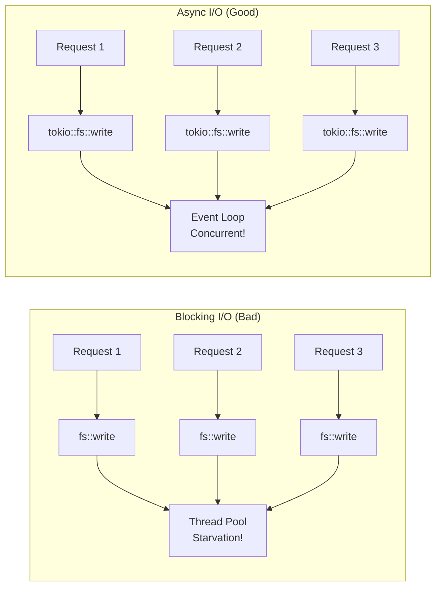

### Memory-Efficient Streaming

```rust
// Instead of loading entire file:
let data = tokio::fs::read("large_file.iso").await?; // OOM for 10GB file!

// Use streaming:
let file = File::open("large_file.iso").await?;
let stream = ReaderStream::new(file); // Only 8KB buffer
let body = Body::wrap_stream(stream);
```

**Memory Comparison:**
- **Blocking approach**: ~10GB RAM for 10GB file
- **Streaming approach**: ~8KB RAM for 10GB file

### Lock Strategy

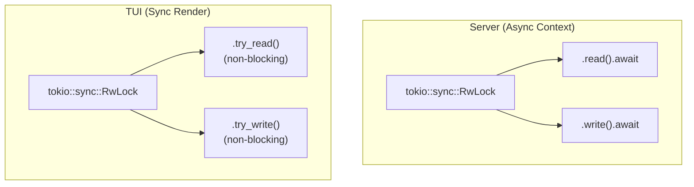

---

## Key Technologies Summary

| Layer | Technology | Purpose |
|-------|------------|---------|
| **Runtime** | Tokio | Async runtime for Rust |
| **Web Framework** | Axum | Type-safe HTTP server |
| **HTTP Client** | Reqwest | HTTP client with streaming |
| **Protocol** | LocalSend v2 | File transfer protocol |
| **Discovery** | UDP Multicast | Device discovery |
| **TLS** | Rustls | TLS 1.3 encryption |
| **UI** | Ratatui | Terminal UI framework |
| **CLI** | Clap | Command-line argument parsing |
| **Serialization** | Serde | JSON serialization/deserialization |
| **Validation** | Thiserror + Anyhow | Error handling |

---

## Data Flow Diagrams

### Send File Flow

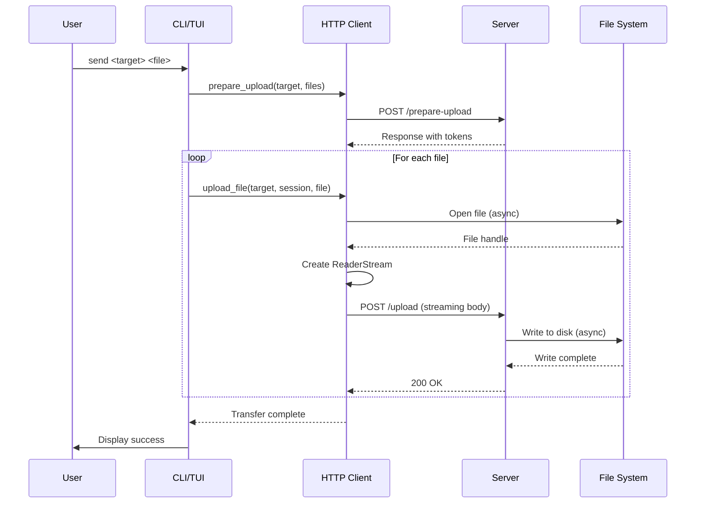

### Receive File Flow

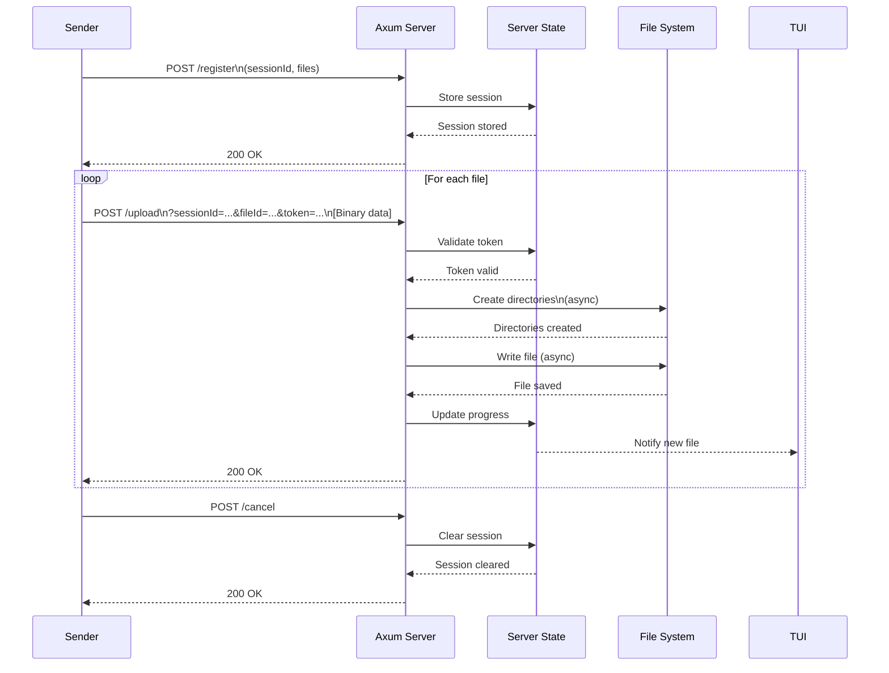

---

## Contributing

See [AGENTS.md](AGENTS.md) for development guidelines and [CHANGELOG.md](CHANGELOG.md) for version history.

---

## References

- [LocalSend Protocol Specification](https://github.com/localsend/protocol)
- [Rust Tokio Runtime](https://tokio.rs/)
- [Axum Web Framework](https://github.com/tokio-rs/axum)
- [Reqwest HTTP Client](https://docs.rs/reqwest/)
- [Rustls TLS](https://github.com/rustls/rustls)
- [Ratatui TUI](https://github.com/ratatui-org/ratatui)
